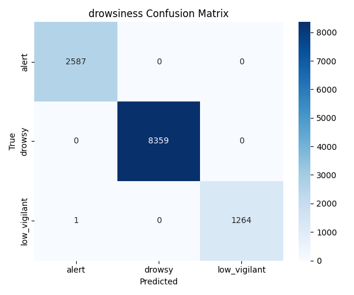

# Multi-Task Driver Drowsiness Detection System

This project implements a deep learning-based **multi-task classification system** to detect signs of **driver drowsiness**, including:
- Drowsiness Level (Alert / Drowsy / Low Vigilant)
- Yawning (Normal / Talking / Yawning)
- Eye State (Open / Closed)

Built using **MobileNetV2**, the model uses **multi-task learning** and preprocessed facial image data to improve road safety through non-intrusive fatigue detection.

## Repository Structure

```
.
├── model_evaluation/
│   ├── blinking_confusion_matrix.png
│   ├── drowsiness_confusion_matrix.png
│   ├── yawning_confusion_matrix.png
│   └── evaluation_metrics.xlsx
├── multi_task_drowsiness_model.h5         # Final trained Keras model
├── preprocess.py                          # Preprocessing pipeline (MAR, contrast, filtering)
├── splitting.py                           # Stratified train/test split per task
├── training.py                            # Model training using MobileNetV2 backbone
├── evaluation.py                          # Full evaluation: metrics, AUC, confusion matrices
├── requirements.txt                       # Dependencies list
└── readme.txt                             
```

---

## Multi-Task Learning Labels

| Task         | Classes                        | Source                         |
|--------------|--------------------------------|--------------------------------|
| Drowsiness   | `alert`, `drowsy`, `low_vigilant` | UTA RLDD, DDD dataset          |
| Yawning      | `normal`, `talking`, `yawning`    | YawDD dataset                  |
| Eye State    | `closed`, `open`                  | CEW (Closed Eyes in the Wild)  |

---

## Requirements

Install dependencies with:

```bash
pip install -r requirements.txt
```

Key libraries:
- `tensorflow`
- `opencv-python`
- `dlib`
- `imutils`
- `pandas`, `matplotlib`, `seaborn`
- `scikit-learn`
- `openpyxl`

---

## Preprocessing (`preprocess.py`)

This script:
- Detects faces using dlib and filters for valid landmarks
- Computes the **Mouth Aspect Ratio (MAR)** for yawning frames
- Applies **CLAHE** for contrast enhancement on grayscale eye images
- Converts video frames to labeled images by directory

**Note**: Dataset paths must be set manually inside the script.

Due to dataset size, image data is not included in this repository.

---

## Dataset Splitting (`splitting.py`)

Creates stratified train/test splits **for each task** (`ddd`, `yawdd`, `eye_state`) using:

```bash
python splitting.py
```

The result is a directory structure like:

```
dataset_split/
├── train/
│   ├── ddd/
│   ├── yawdd/
│   └── eye_state/
└── test/
    ├── ddd/
    ├── yawdd/
    └── eye_state/
```

---

## Model Training (`training.py`)

This script:
- Loads `MobileNetV2` as a base model
- Adds 3 heads for drowsiness, yawning, and blinking
- Trains the network with categorical crossentropy loss
- Optionally applies oversampling or class weights
- Saves the model as `.h5` and TensorFlow.js-compatible format

Run:

```bash
python training.py
```

---

## Evaluation (`evaluation.py`)

This script:
- Loads the trained model
- Predicts on test sets for each task
- Computes:
  - Accuracy
  - Per-class precision, recall, F1-score
  - ROC AUC score (OvR)
  - Per-class accuracy
  - Confusion matrix heatmaps

Results are saved to:

- **Confusion matrices**: `model_evaluation/*_confusion_matrix.png`
- **Excel report**: `model_evaluation/evaluation_metrics.xlsx`

Run:

```bash
python evaluation.py
```

---

## 🧾 Example Metrics Output

| Task       | Accuracy | ROC AUC |
|------------|----------|---------|
| Drowsiness | 0.9999   | 1.0000  |
| Yawning    | 0.5709   | 0.4548  |
| Blinking   | 0.5437   | 0.5999  |

Example confusion matrix:



---

## How to Run

1. **Download and place your datasets**
   - UTA Real-Life Drowsiness Dataset (RLDD): https://www.kaggle.com/datasets/rishab260/uta-reallife-drowsiness-dataset
   - Driver Drowsiness Dataset (DDD): https://www.kaggle.com/datasets/ismailnasri20/driver-drowsiness-dataset-ddd
   - YawDD: https://ieee-dataport.org/open-access/yawdd-yawning-detection-dataset
   - UnityEyes Drowsiness Detection Dataset: https://www.kaggle.com/datasets/hazemfahmy/openned-closed-eyes

2. **Update paths** in `preprocess.py` to your local dataset locations

3. Run the full pipeline:
```bash
python preprocess.py
python splitting.py
python training.py
python evaluation.py
```

---

## Model Highlights

- Multi-task learning shares a MobileNetV2 feature encoder across three tasks
- Each task learns independently through its own classification head
- Drowsiness is most accurate; yawning remains challenging due to subtle variance
- Modular design allows for dataset or model replacement

---

## License

MIT License. Free to use, modify, and distribute.
